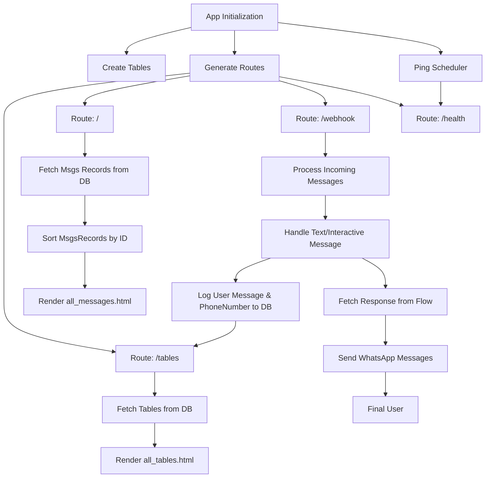

# Whatsapp_Chatbot_v3
This repository hosts a Python-based chatbot demo that integrates with the WhatsApp Business API (Meta API) to facilitate automated messaging and interactions within a WhatsApp Business test environment.  

> [!IMPORTANT]
> Please note that the chatflow conversation must be managed from ~within the code~ a json file, as this repository does not include the module to configure the conversation flow through block diagrams in the frontend... just yet.
> 

# Features
- **WhatsApp Business Integration**: Seamless integration with the WhatsApp Business API for message handling.
- **Modular Structure**: The project is organized into modular components for better maintainability and scalability.
- **Web Interface**: Simple HTML-based interface to interact with the database model for the chatbot. (In progress)
- **Logging**: Custom logging utility to monitor and track application behavior. (In progress)

# Project Structure
```
Whatsapp_Chatbot_v3/
└── app/
│   ├── config.py
│   ├── controllers/
│   │   └── routes_controller.py
│   ├── core/
│   │   └── robot/
│   │       ├── entryPoint.py
│   │       └── saveMessage.py
│   ├── interfaces/
│   │   ├── api/
│   │   │   └── whatsapp_api.py
│   │   └── crud/
│   │       └── models_repo.py
│   ├── models/
│   │   ├── database/
│   │   └── orm/
│   ├── services/
│   │   └── modelServices.py
│   ├── stack/
│   │   └── constant/
│   └── web/
│       ├── static/
│       └── templates/
├── requirements.txt
└── run.py
```
*Full project structure can be found* [here](https://github.com/m1guel17/Whatsapp_Chatbot_v3/blob/main/project_structure.md)

## App Logic 


# Getting Started
### Prerequisites

- Python 3.12
- Flask
- Other dependencies listed in requirements.txt

### Deployment
1. **Clone the repository:**
   ```bash
   git clone https://github.com/m1guel17/Whatsapp_Chatbot_v3.git
   cd Whatsapp_Chatbot_v3
   ```
2. **Install the required dependencies:**
    ```bash
    pip install -r requirements.txt
    ```
3. **Set up the Environment Variables:**
   ```
   DOMAIN_URL=<your_domain_url>
   NUMBER_HOST=<your_number_host>
   NUMBER_ID=<your_number_id>
   VERIFY_TOKEN=<your_verify_token>
   VERSION=<api_version>
   WHATSAPP_TOKEN=<your_whatsapp_token>
   ```
   *Description and examples for keys can be found* [here](https://github.com/m1guel17/Whatsapp_Chatbot_v3/blob/main/keys_description.md) <br /><br />
4. **Run the application:**
   ```bash
   python3.12 run.py
   ```

## Contributing
Contributions are welcome! Please fork this repository and submit a pull request with your enhancements or bug fixes.


